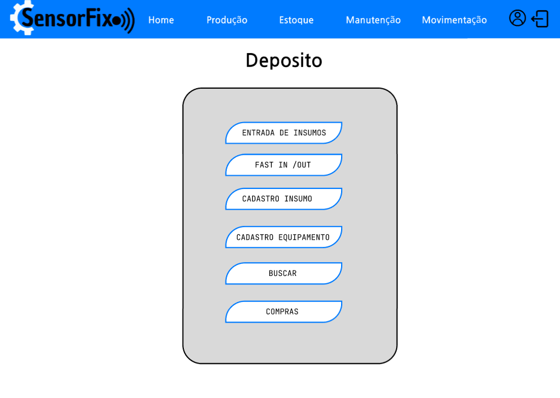
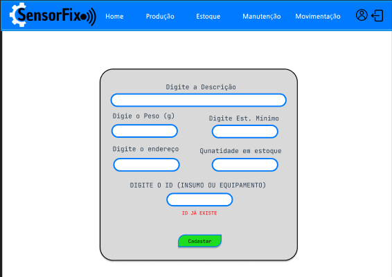

### 3.3.1 Processo 1 – Gestão de Estoque
**Visualize nossas telas de Gestão de Estoque** : https://www.figma.com/design/Vkmkji04iF8n2CzsODUhaR/Gest%C3%A3o-de-estoque?node-id=0-1&t=TWNfgPBcTlsB8Ig7-1

#### Detalhamento das atividades

O processo de Gestão de Estoque esta relacionada ao controle e organização de um grupo de produtos e insumos que necessitam de gestão visando a demanda da organização para que tenha-se sempre insumos disponíveis para uso. 

Em nosso processo de Gestão de Estoque temos três pontos iniciais. São eles a chegada de insumos do  fornecedor, a solicitação de compra e por fim atendimento de solicitações internas de insumo.

No momento que mercadorias novas chegam, inicia-se a alocação dos produtos em estoques. Com o sistema aberto clica-se no botão "Realizar entrada de insumos ", ao clicar nesse botão será aberta uma página com um formulário para iniciar o a entrada quantificada de produtos. Inicia-se digitando  o ID do insumo ou equipamento, em caso de ID cadastrado basta colocar o insumo na patraleira com o endereço correto e digitar a quantidade de insumos que desejar dar entrada. Em caso de ID não cadastrado, basta clicar no botão cadastrar que aparecerá assim que o ID for identificado como desconhecido, com isso será direcionado para a página de cadastro.

Para realizar o pedido de compra, basta clicar no botão "Abrir um pedido de compra". Em seguida, será aberta uma aba com um espaço para adicionar livremente um insumo de sua escolha. Basta clicar no botão "+" digitar o ID do insumo e a quantidade desejada. Nos casos em que o insumo não estiver cadastrado, será possível inserir os detalhes do item diretamente no pedido de compra, e o cadastro poderá ser realizado no momento em que ele for entregue.Também será exibida uma lista de sugestões de compra, com base nos itens que se encontram em estoque crítico. Ao incluir todos os elemento no pedido de compra poderá atrelar ou não a ele um ou mais forncedor(es). Finalizar o pedido de compra enviando para o setor de faturamento.

Outro gatilho do nosso processo é a solicitação interna de demanda. Ao clicar no botão "Fast in/Out" voce será direcionado para uma aba onde a ideia é promover agilidade ao user, nesta aba voce digitará o ID do produto e poderá selecionar se é saída ou entrada, digitando também a quantidade e podendo atrelar essa saída a um comentário. Pós isso basta clicar em salvar e com isso finaliza-se o processo salvando as alterações em banco de dados.

Na escolha da Manutenção de Cadastro você pode digitar o ID do insumo ou equipamento e com isso abrirá, automáticamente, uma aba personalizada para insumos ou equipamentos. Em caso de insumos teremos os dados default e será possível sobrescrever os dados e salvar as alterações. Em caso de equipamento será possível sobrescrever os dados e também alterar os insumos que o compõem. Todo equipamento é um conjunto de insumos.

_Os tipos de dados a serem utilizados são:_

_* **Área de texto** - campo texto de múltiplas linhas_

_* **Caixa de texto** - campo texto de uma linha_

_* **Número** - campo numérico_

_* **Seleção única** - campo com várias opções de valores que são mutuamente exclusivas (tradicional radio button ou combobox)_

_* **Classes** - Modelagem para objetos_

**Escolher uma opção dos serviços de Gestão de Estoque**

| **Comandos**         |  **Destino**                   | **Tipo** |
| ---                  | ---                           | ---               |
|ENTRADA DE INSUMOS| Inicia a entrada de isumos que chegaram ao estoque | redirecionador |
| FAST IN /OUT |Direciona para a página que posssibilita a entrada e saída rápida de insumos ou queipamentos do estoque                              |    redirecionador               |
| CADASTRO DE INSUMO            | Incia processo de cadastro de insumo.             |redirecionador  |
| CADASTRO DE EQUIPAMENTO             | Incia processo de cadastro de equipamento.             |redirecionador  |
| BUSCAR             | Possibilita que o usuário faça a exclusão ou a edição de um equipamento ou insumo              |redirecionador  |
| COMPRAS             | Inicia um pedido de compra            |redirecionador  |

**Realziar entrada de insumos**

| **Campo**       | **Tipo**         | **Restrições** | **Valor default** |
| ---             | ---              | ---            | ---               |
| Digitar o ID    | Caixa de Texto   |Apenas números, nocaso do nosso ID serão seis números   | vazio|
| Quantidade de entrada|Caixa de Texto|valores Inteiros |Vazio|
|Descrição|Caixa de Texto|Letras ou números|Preenchimento automático em função do ID|
|Peso|Caixa de Texto|Apenas números |Preenchimento automático|
|Quantidade em estoque |Caixa de Texto|Números |Preenchimento automático|
|Endereço|Caixa de Texto|Apenas caracteres |Preenchimento automático|
|Estoque Minimo|Caixa de Texto|Números |Preenchimento automático|

| **Comandos**         |  **Destino**                   | **Tipo** |
| ---                  | ---                            | ---               |
| Buscar | Busca o id do equipamento  | botão |
| Cadastrar um insumo ou equipamento| Abre a aba de cadastro de um insumo/equipamento em caso do momento da entrada não estiver cadastrado|botão    |
| Entrada| Salva a quantidade do elemento que foi dada a entrada| botão|

**Solicitação de Compra**

| **Campo**       | **Tipo**         | **Restrições** | **Valor default** |
| ---             | ---              | ---            | ---               |
| Busca o ID            | Caixa de texto            | Seis valores inteiros            | "Digite o ID"               |
|Descrição|Caixa de Texto|- |Preenchimento automático|

| **Comandos**         |  **Destino**                   | **Tipo**          |
| ---                  | ---                            | ---               |
| Incluir | Inclui o ID que foi digitado e consultado  | botão. Em caso de produto não cadastrado abre um pop up onde coloca-se toda a descrição do produto e este entra no pedido de compra e futuramente será cadastrado na entrada de insumos.  |
|Fonecedor |Abre a aba de fornecedores e adidicona o escolhido |botão|
|Concluir |Finaliza o pedido de compra |botão|

**Fast In/Out**

| **Campo**       | **Tipo**         | **Restrições** | **Valor default** |
| ---             | ---              | ---            | ---               |
| Digitar o ID | Caixa de Texto|      Seis valores inteiros |  vazio              |
| Quantidade| Caixa de texto|     Quantidades superiores às em estoque e valores menores que 1 |"Digite o valor de Entrada ou Saída"               |
| Digitar o comentárioda retirada | String|  100 caractéres | "-"|
| Saída | Check Box |  - | Marcada|
| Entrada | Check Box |  - | Desmarcada|
| Deposito | Combo box |  - | Restrito aos despositos existentes|

| **Comandos**         |  **Destino**                   | **Tipo**          |
| ---                  | ---                            | ---               |
| Btn salvar | Salva o valor de saída ou entgarda  | botão |
| CheckBox Saída |Cnfirma que o ato em função do valor será de retida |botão|
| CheckBox Entrada |Cnfirma que o ato em função do valor será reposto |botão|
| Agregar |Confirma a ação de entrada ou saída |botão|

**Cadastro de inusmo / equipamento**

| **Campo**       | **Tipo**         | **Restrições** | **Valor default** |
| ---             | ---              | ---            | ---               |
| Digitar o ID    | Caixa de Texto   |Apenas número   |    "Digite o id do equipamento"|
|Descrição|Caixa de Texto|Apenas caracteres|Preenchimento automático com possibilidade de alteraçã|
|Peso|Caixa de Texto|Apenas caracteres |Preenchimento automático com possibilidade de alteraçã|
|Quantidade em estoque |Caixa de Texto|Apenas caracteres |Preenchimento automático com possibilidade de alteraçã|
|Endereço|Caixa de Texto|Apenas caracteres |Preenchimento automático com possibilidade de alteração|
|Estoque Minimo|Caixa de Texto|Apenas caracteres |Preenchimento automático com possibilidade de alteraçã|
|Add insumo|Caixa de Texto|Seis valores inteiros |vazio|

| **Comandos**         |  **Destino**                   | **Tipo**          |
| ---                  | ---                            | ---               |
| Btn Cadastrar | Salva as alterações feitas | botão |
| Btn Agregar|Atrela a aquele equipamento um novo inusmo |botão|

**Edição de inusmo / equipamento**

| **Campo**       | **Tipo**         | **Restrições** | **Valor default** |
| ---             | ---              | ---            | ---               |
| Digitar o ID    | Caixa de Texto   |Apenas número   |    "Digite o id do equipamento"|
|Descrição|Caixa de Texto|Apenas caracteres|Preenchimento automático com possibilidade de altereção|
|Peso|Caixa de Texto|Apenas caracteres |Preenchimento automático com possibilidade de altereção|
|Quantidade em estoque |Caixa de Texto|Apenas caracteres |Preenchimento automático com possibilidade de altereção|
|Endereço|Caixa de Texto|Apenas caracteres |Preenchimento automático com possibilidade de altereção|
|Estoque Minimo|Caixa de Texto|Apenas caracteres |Preenchimento automático com possibilidade de altereção|

| **Comandos**         |  **Destino**                   | **Tipo**          |
| ---                  | ---                            | ---               |
| Btn Buscar | Buscar ID e puxa informações  | botão |
| Btn Agregar|Atrela a aquele equipamento um novo inusmo |botão|
| Btn check |Busca insumo para análise do usuário, decidir se entra na composição do equipamento |botão|
| Btn Salvar |Salva alterações realizadas |botão|