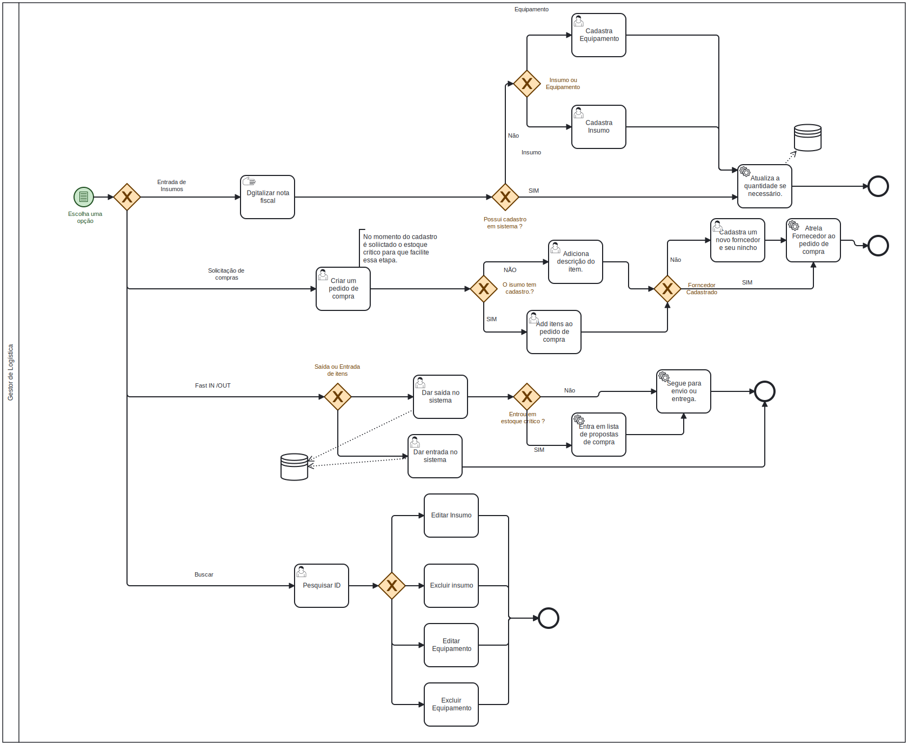

### 3.3.1 Processo 1 – Gestão de Estoque

_Apresente aqui o nome e as oportunidades de melhoria para o processo 1. 
Em seguida, apresente o modelo do processo 1, descrito no padrão BPMN._

#### Detalhamento das atividades

O processo de Gestão de Estoque esta relacionada ao controle e organização de um grupo de produtos e insumos que necessitam de gestão visando a demanda da organização para que tenha-se sempre insumos disponíveis para uso. 

Em nosso processo de Gestão de Estoque temos três pontos iniciais. São eles a chegada de insumos do  fornecedor, a solicitação de compra e por fim atendimento de solicitações internas de insumo.

No momento que mercadorias novas chegam, inicia-se a alocação dos produtos em estoques. Com o sistema aberto clica-se no botão "Realizar entrada de insumos ", ao clicar nesse botão será aberta uma página com um formulário para iniciar o a entrada quantificada de produtos. Inicia-se digitando  o ID do insumo ou equipamento, em caso de ID cadastrado basta colocar o insumo na patraleira com o endereço correto e digitar a quantidade de insumos que desejar dar entrada. 

Para realizar o pedido de compra, basta clicar no botão "Abrir um pedido de compra". Em seguida, será aberta uma aba com um espaço para adicionar livremente um insumo de sua escolha. Basta digitar o ID do insumo e a quantidade desejada.Nos casos em que o insumo não estiver cadastrado, será possível inserir os detalhes do item diretamente no pedido de compra, e o cadastro poderá ser realizado no momento em que ele for entregue.Também será exibida uma lista de sugestões de compra, com base nos itens que se encontram em estoque crítico. Além disso, será possível adicionar outros insumos de sua preferência clicando no botão "+". Ao incluir todos os elemento no pedido de compra poderá atrelar ou não a ele um ou mais forncedor(es). Finalizar o pedido de compra enviando para o setor de faturamento.

O último gatilho do nosso processo é a solicitação interna de demanda. Ao clicar no botão "Fast in/Out" voce será direcionado para uma aba onde a ideia é promover agilidade ao user, nesta aba voce digitará o ID do produto e poderá selecionar se é saída ou entrada, digitando também a quantidade e podedo atrelar essa saída a um comentário. Pós isso basta clicar em salvar e com isso finaliza-se o processo salvando as alterações em banco de dados.

_Os tipos de dados a serem utilizados são:_

_* **Área de texto** - campo texto de múltiplas linhas_

_* **Caixa de texto** - campo texto de uma linha_

_* **Número** - campo numérico_

_* **Seleção única** - campo com várias opções de valores que são mutuamente exclusivas (tradicional radio button ou combobox)_

**Escolher uma opção dos serviços de Gestão de Estoque**

| **Comandos**         |  **Destino**                   | **Tipo** |
| ---                  | ---                           | ---               |
| Btn Realizar Entrada de insumos| Inicia subprocesso de entarda de inusmos | redirecionador |
| Btn Realizar pedido de compra|Inicia subprocesso de solicitação de compras                                |    redirecionador               |
| Btn Fast In/Out               | Incia processo de entrada ou saída de insumo             |redirecionador  |

**Realziar entrada de insumos**

| **Campo**       | **Tipo**         | **Restrições** | **Valor default** |
| ---             | ---              | ---            | ---               |
| Digitar o ID      | Caixa de Texto|     Apenas número            |    "Digite o id do equipamento"               |
| Dgitar o endereço físico| Seguir padrão "letra+num+num+num+num"| endereços que não existem no estoque |  "Digite o endereço"|
| Descrição           | Caixa de Texto   |String |"Descrição"  |             
| Estoque mínimo           | Caixa de Texto   | valores inteiros |      "Est.Min"     |
| Componentes         | CheckBox  | Ao cadastrar um equipamento é necessáriocolocar seus insumos |     Nada marcado      |
| Quantidade de entrada         | Caixa de Texto  | valores Inteiros |      Vazio    |

| **Comandos**         |  **Destino**                   | **Tipo** |
| ---                  | ---                            | ---               |
| Btn Consultar o ID | Busca o id do equipamento  | botão |
| Btn Cadastrar um insumo| Abre a aba de cadastro de um insumo/equipamento|botão    |
| Btn Salvar Cadstro               | Finaliza o cadastro| botão|
|             |   |                   |

**Solicitação de Compra **

| **Campo**       | **Tipo**         | **Restrições** | **Valor default** |
| ---             | ---              | ---            | ---               |
| Descrição | String  |      "Nome do equipamento"       |             "Digite a descrição do insumo  que deseja"      |
| Digitar o ID | Caixa de Texto|      Seguir padrão "letra+num+num+num+num"           |    "Digite o id do equipamento"               |
| Digitar o nome do fonecedor | Caixa de Texto|     String           |    "Nome"               |
| Digitar o numero do Fornecedor | String|     Teremos uma mascara para num"| "() -"

| **Comandos**         |  **Destino**                   | **Tipo**          |
| ---                  | ---                            | ---               |
| Btn Adiciona insumo | Abre campo para buscar o insumo/equipamento que deseja  | botão |
| Btn Confirma insumo |Confirmar entarda do insumo no pedido de compra|botão|
| Btn Atrela Fornecedor |Permite ao pedido de compra atrelar um forncedor |botão|

**Fast In/Out**

| **Campo**       | **Tipo**         | **Restrições** | **Valor default** |
| ---             | ---              | ---            | ---               |
| Digitar o ID | Caixa de Texto|      Seguir padrão "letra+num+num+num+num"           |    "Digite o id do equipamento"               |
| Digitar a quantidade que deseja | Int |     Valores Lierais           |    "-"               |
| Digitar o comentárioda retirada | String|  100 caractéres | "-"|

| **Comandos**         |  **Destino**                   | **Tipo**          |
| ---                  | ---                            | ---               |
| Btn salvar | Salva o valor de saída ou entgarda  | botão |
| CheckBox Saída |Cnfirma que o ato em função do valor será de retida |botão|
| CheckBox Entrada |Cnfirma que o ato em função do valor será reposto |botão|