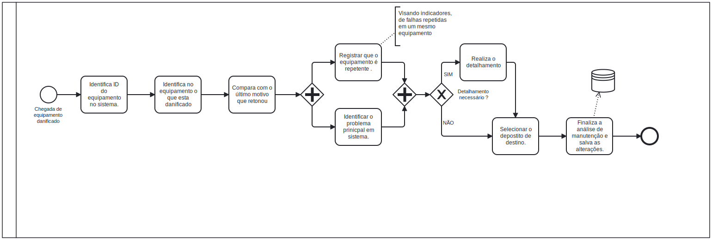

### 3.3.4 Processo 4 – Manutenção 

### Nome do Processo
Manutenção de Equipamentos

### Oportunidades de Melhoria
- Melhor rastreamento de equipamentos que retornam para manutenção múltiplas vezes.
- Redução do tempo de diagnóstico e encaminhamento para manutenção.
- Registro mais detalhado dos problemas identificados para análise de recorrência.
- Automatização da identificação do depósito de destino.
  

#### Detalhamento das atividades

O processo de manutenção tem como objetivo garantir que os equipamentos defeituosos sejam identificados, analisados e reparados de forma eficiente, assegurando sua disponibilidade e funcionamento adequado. Esse processo é composto por três principais atividades: **Identificação do Equipamento, Identificação do Problema e Encaminhamento para Manutenção.**

Quando um equipamento com defeito chega para manutenção, o primeiro passo é sua identificação e registro no sistema. Com o sistema aberto, o técnico deve clicar na opção "Registrar Equipamento", que abrirá uma tela para preenchimento das informações básicas. O técnico deve inserir o ID do equipamento ou, caso não esteja cadastrado, adicionar manualmente os dados necessários.
Caso o equipamento já tenha passado por manutenções anteriores, essa informação será exibida automaticamente, facilitando a análise de problemas recorrentes. Além disso, pode ser anexada uma imagem do equipamento para melhor documentação do processo.

Após a identificação do equipamento, o técnico inicia a análise do problema. Para isso, deve clicar no botão "Registrar Problema", onde será aberto um formulário para detalhamento da falha. O técnico deve descrever qual componente está danificado, fornecer um detalhamento da falha e indicar se há necessidade de informações adicionais.
Caso o problema seja recorrente, será exibida uma lista de falhas semelhantes registradas anteriormente, permitindo a identificação de padrões. Também será possível anexar evidências visuais do defeito, como imagens ou relatórios técnicos.

Após o registro do problema, o equipamento deve ser encaminhado para reparo. Para isso, o técnico deve clicar em "Encaminhar para Manutenção", o que abrirá um campo para definir quem será o responsável pelo reparo e o local onde o equipamento será armazenado temporariamente.
O sistema registrará automaticamente a data e a hora do encaminhamento, garantindo um controle preciso do fluxo de manutenção. Além disso, o técnico pode selecionar o setor responsável e o técnico designado para o serviço.

_Os tipos de dados a serem utilizados são:_

_* **Área de texto** - campo texto de múltiplas linhas_

_* **Caixa de texto** - campo texto de uma linha_

_* **Número** - campo numérico_

_* **Data** - campo do tipo data (dd-mm-aaaa)_

_* **Hora** - campo do tipo hora (hh:mm:ss)_

_* **Data e Hora** - campo do tipo data e hora (dd-mm-aaaa, hh:mm:ss)_

_* **Imagem** - campo contendo uma imagem_

_* **Seleção única** - campo com várias opções de valores que são mutuamente exclusivas (tradicional radio button ou combobox)_

_* **Seleção múltipla** - campo com várias opções que podem ser selecionadas mutuamente (tradicional checkbox ou listbox)_

_* **Arquivo** - campo de upload de documento_

_* **Link** - campo que armazena uma URL_

_* **Tabela** - campo formado por uma matriz de valores_

**Escolher uma opção dos serviços de Manutenção**

**Identificação do Equipamento**

| **Campo**       | **Tipo**         | **Restrições** | **Valor default** |
| ---             | ---              | ---            | ---               |
| **ID do equipamento**  |  Número   | Obrigatório    |    -               |
| **Número de série**    | Caixa de Texto   | Alfanumérico, obrigatório |                |
| **Imagem do equipamento**          | Imagem   | Formato PDF, JPG, PNG |           |
| **Equipamento já teve retorno antes?**  |  Seleção única   | Opções: Sim/Não    |    -               |

| **Comandos**         |  **Destino**                   | **Tipo** |
| ---                  | ---                            | ---               |
| ***Próximo***       |    Identificação do Problema    | default            |

**Identificação do Problema**

| **Campo**       | **Tipo**         | **Restrições** | **Valor default** |
| ---             | ---              | ---            | ---               |
| Componente danificado | Caixa de texto  | Obrigatório  |                   |
| Detalhamento do problema | Área de texto | Mínimo 10 caracteres |                   |
| Necessário detalhamento adicional? | Seleção única | Opções Sim/Não |                   |
| Registro de falhas recorrentes | Seleção múltipla | Listagem de falhas comuns |            |
| Evidência do problema | Arquivo | Formato PDF, JPG, PNG |            |

| **Comandos**         |  **Destino**                   | **Tipo**          |
| ---                  | ---                            | ---               |
| Próximo              |  Encaminhamento para Manutenção | default                  |
| Voltar  |  Encaminhamento para Manutenção | default                  |

**Encaminhamento para Manutenção**

| **Campo**       | **Tipo**         | **Restrições** | **Valor default** |
| ---             | ---              | ---            | ---               |
| Data de encaminhamento | Data e hora  | Automático  |  Data/Hora atual  |
| Técnico responsável | Seleção única | Lista de técnicos cadastrados |    -               |
| Depósito de destino | Seleção única | Lista de depósitos cadastrados | -                  |
| Registro de falhas recorrentes | Seleção múltipla | Listagem de falhas comuns |            |
| Evidência do problema | Arquivo | Formato PDF, JPG, PNG |            |

| **Comandos**         |  **Destino**                   | **Tipo**          |
| ---                  | ---                            | ---               |
| Finalizar |  Fim do Processo | default                |
| Voltar  |  Identificação do Problema | cancel    |

