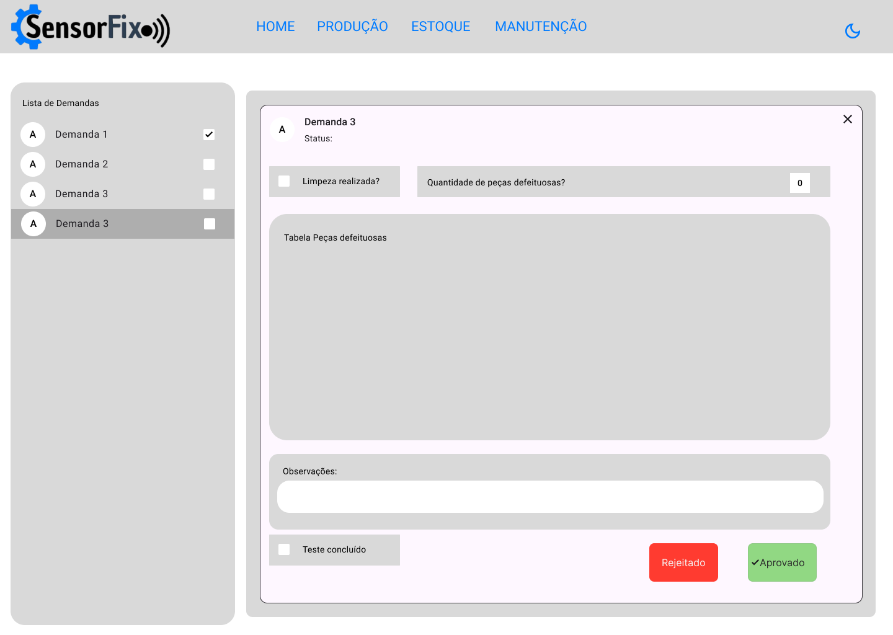

### 3.3.2 Processo 2 – Processo de Produção

_Apresente aqui o nome e as oportunidades de melhoria para o processo 2. 
Em seguida, apresente o modelo do processo 2, descrito no padrão BPMN._

#### Detalhamento das atividades
O processo de produção se inicia com a chegada de um pedido, onde é necessário gerar uma nova demanda de produção. Para isso, o sistema permite a criação automática de uma demanda, gerando um número único para identificação. O responsável pela produção clica no botão "Gerar demanda", registrando a solicitação no sistema e permitindo o acompanhamento das próximas etapas. Em seguida, o usuário deve abrir a demanda para análise e execução, clicando no botão "Abrir demanda", o que possibilita a verificação dos detalhes da solicitação e a preparação para a próxima fase.  

Após a abertura da demanda, ocorre a verificação do processo da demanda, onde a equipe responsável inspeciona o equipamento para avaliar se ele precisa passar por limpeza e recuperação antes da continuidade do processo. Se não houver problemas, a demanda segue normalmente, mas caso sejam identificadas falhas ou necessidade de reparos, o sistema indicará os próximos passos para recuperação.  

Se o equipamento precisar de recuperação, ele passará pelo processo de limpeza e troca de peças defeituosas. A equipe realiza a limpeza necessária e, caso existam peças defeituosas, elas serão substituídas por novas. No sistema, o responsável marca na demanda que a limpeza foi realizada. Caso o produto não possa ser recuperado, ele será encaminhado para descarte conforme os protocolos internos.  

Após a recuperação do equipamento, é necessário registrar as informações da manutenção no sistema, preenchendo a documentação associada à demanda. Esse registro é essencial para controle interno e rastreamento do processo de produção. Com o equipamento limpo e recuperado, inicia-se a fase de testes, cujo objetivo é garantir que o produto esteja funcionando corretamente. O responsável realiza os testes conforme os critérios estabelecidos, e caso sejam bem-sucedidos, a demanda avança para a finalização do processo. Se os testes falharem, o produto será transferido para o setor de defeituosos, onde será analisado para reaproveitamento de peças ou descarte.  

Caso os testes sejam aprovados, o processo de produção é finalizado. O responsável dá baixa no sistema, confirmando que o equipamento está pronto para uso. O produto é então transferido para o departamento de estoque, onde ficará disponível para envio ou utilização. Com isso, a demanda é encerrada e registrada como concluída no sistema, garantindo que o processo foi finalizado corretamente.

_Os tipos de dados a serem utilizados são:_

_* **Área de texto** - campo texto de múltiplas linhas_

_* **Caixa de texto** - campo texto de uma linha_

_* **Número** - campo numérico_

_* **Data** - campo do tipo data (dd-mm-aaaa)_

_* **Hora** - campo do tipo hora (hh:mm:ss)_

_* **Data e Hora** - campo do tipo data e hora (dd-mm-aaaa, hh:mm:ss)_

_* **Imagem** - campo contendo uma imagem_

_* **Seleção única** - campo com várias opções de valores que são mutuamente exclusivas (tradicional radio button ou combobox)_

_* **Seleção múltipla** - campo com várias opções que podem ser selecionadas mutuamente (tradicional checkbox ou listbox)_

_* **Arquivo** - campo de upload de documento_

_* **Link** - campo que armazena uma URL_

_* **Tabela** - campo formado por uma matriz de valores_

**Preencher Demanda de Produção**  

| **Campo**                 | **Tipo**        | **Restrições**                                    | **Valor default**        |  
|----------------|-----------------|---------------------------|--------------------|  
| Numero da Demanda       | Número         | Obrigatório            | Gerado automaticamente  |  
| Data e Hora da Criação  | Data/Hora      | Automático              | Gerado automaticamente |  
| Setor Responsável       | Seleção Única  | "Produção"/"Manutenção" | -                      |  
| ID do Insumo            | Número         | Obrigatório            | -                       |  
| Descrição do Item       | Texto          | -                      | -                       |  
| Limpeza realizada?      | Seleção Única  | Formato Radio          | false                   |  
| QtdPeçasDefeituosas     | Número         | -                       | 0                      |  
| Peças com defeito       | Tabela         | Baseada em QtdPeçasDefeituosas | -               |  
| Produto recuperado?     | Seleção Única  | Sim/Não                 | false                  |  
| Observações             | Área de texto  | Nome                    | -                      |  
| Relatório de testes     | Área de texto  | Formato de e-mail       | -                      |  
| Teste bem sucedido?     | Seleção Única  | Formato Radio           | false                  |  
| Status da Demanda       | Seleção Única  | Em andamento/Finalizado | -                      |  

---

| **Comandos**               | **Destino**                                | **Tipo**             |  
| ------------------------- | -------------------------------- |----------------------|  
| **[Nome do botão/link]**  | Atividade/processo de destino       | (default/cancel)  |  

**_Exemplo:_**  

| **Comandos**              | **Destino**                                | **Tipo**          |  
|--------------------------|--------------------------------|----------------|  
| Abrir demanda           | Início do processo de produção     | default |  
| Registrar limpeza       | Confirma a higienização            | confirmar/cancelar |  
| Registrar recuperação   | Confirma recuperação do equipamento| confirmar/cancelar |  
| Teste realizado        | Realização do teste                | (sucedido/falha) |  
| Produto defeituoso?     | Encaminhar para descarte/reciclagem | confirmar/cancelar |  
| Transferir para Estoque | Conclui e destina ao estoque       | confirmar/cancelar |  
| Finalizar produto       | Fim do processo/Liberação para envio | confirmar/cancelar |  

### Protótipo da tela

