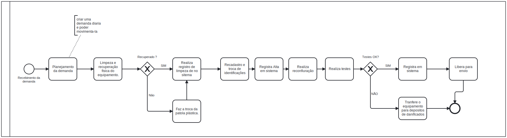

### 3.3.2 Processo 2 – Processo de Produção

_Apresente aqui o nome e as oportunidades de melhoria para o processo 2. 
Em seguida, apresente o modelo do processo 2, descrito no padrão BPMN._

#### Detalhamento das atividades

_Descreva aqui cada uma das propriedades das atividades do processo 2. 
Devem estar relacionadas com o modelo de processo apresentado anteriormente._

_Os tipos de dados a serem utilizados são:_

_* **Área de texto** - campo texto de múltiplas linhas_

_* **Caixa de texto** - campo texto de uma linha_

_* **Número** - campo numérico_

_* **Data** - campo do tipo data (dd-mm-aaaa)_

_* **Hora** - campo do tipo hora (hh:mm:ss)_

_* **Data e Hora** - campo do tipo data e hora (dd-mm-aaaa, hh:mm:ss)_

_* **Imagem** - campo contendo uma imagem_

_* **Seleção única** - campo com várias opções de valores que são mutuamente exclusivas (tradicional radio button ou combobox)_

_* **Seleção múltipla** - campo com várias opções que podem ser selecionadas mutuamente (tradicional checkbox ou listbox)_

_* **Arquivo** - campo de upload de documento_

_* **Link** - campo que armazena uma URL_

_* **Tabela** - campo formado por uma matriz de valores_

**Preencher demanda de Produção**

| **Campo**       | **Tipo**         | **Restrições** | **Valor default** |
| ---             | ---              | ---            | ---               |
| Limpeza realizada?    | Seleção única | Formato Radio | false   |
| QtdPeçasDefeituosas   | número    | ---            | 0  |
| Peças com defeito  | Tabela    | Tabela gerada de acordo com QtdPeçasDefeituosas |   |
| Observações | Área de texto  |      none          |                  |
| Relatório de testes          | Área de texto   | formato de e-mail |                |
| Teste bem sucedido?           | Seleção única | Formato Radio |  false|

| **Comandos**         |  **Destino**                   | **Tipo** |
| ---                  | ---                            | ---               |
| [Nome do botão/link] | Atividade/processo de destino  | (default/cancel  ) |
| ***Exemplo:***       |                                |                   |
| Abrir demanda   | Inicio do processo de produção             | default           |
| Teste realizado            | Realização do teste  | (sucedido/falha)    |
| Produto defeituoso?           | Encaminhar produto para setor de descarte/reciclagem  |  (confirmar/cancelar)     |
| Finalizar produto            | Fim do processo/Liberação para envio  | (confirmar/cancelar|

