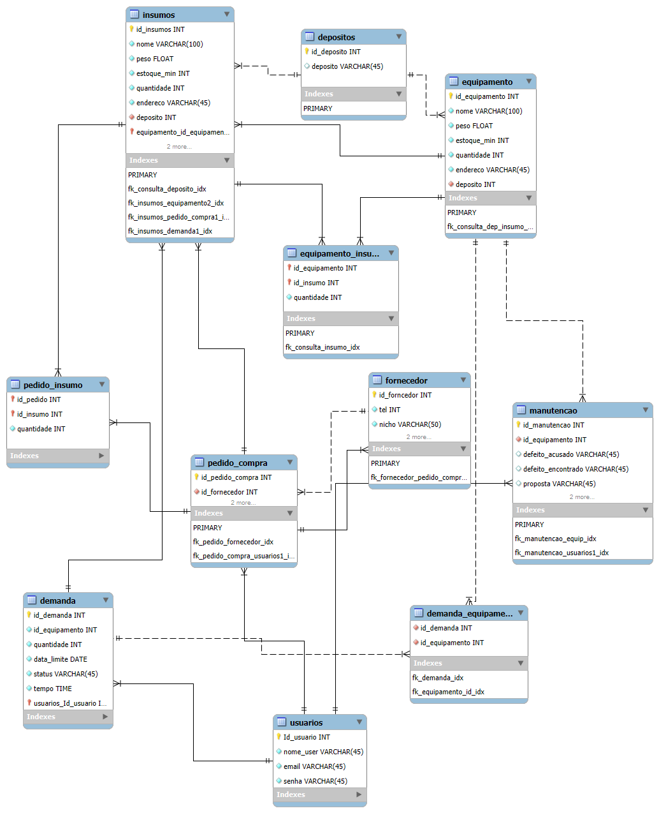

## 4. Projeto da solução

### 4.1. Modelo de dados

### 4.2. Tecnologias

O projeto utiliza um conjunto de tecnologias modernas para garantir robustez, segurança, escalabilidade e uma boa experiência do usuário. A seguir, estão listadas as principais tecnologias empregadas, abrangendo desde o desenvolvimento até o deploy da aplicação.

| **Dimensão**   | **Tecnologia**  |
| ---            | ---             |
| **SGBD**       | MySQL (deploy no Azure SQL Database) |
| **Front-end**  | React + React Router DOM (para rotas SPA) + Bootstrap + Chart.js (para gráficos e indicadores) |
| **Back-end**   | Java Spring Boot + Spring Security 5 (para autenticação e segurança) |
| **Deploy Front-end** | Netlify (hospedagem de aplicações front-end com CI/CD) |
| **Deploy Back-end** | Azure App Service (hospedagem da API Java Spring Boot) via GitHub Actions |
| **Deploy SGBD** | Azure SQL Database (MySQL gerenciado na nuvem) |
| **CI/CD**      | GitHub Actions (automação dos pipelines de build e deploy para o Azure) |

### Descrição das tecnologias

- **React:** Biblioteca JavaScript para construção de interfaces de usuário reativas e componentizadas.
- **React Router DOM:** Gerenciamento de rotas no front-end, permitindo navegação de páginas sem recarregamento (SPA).
- **Bootstrap:** Framework CSS para desenvolvimento responsivo e com design consistente.
- **Chart.js:** Biblioteca JavaScript para criação de gráficos dinâmicos e interativos, usada na visualização dos indicadores.
- **Spring Boot:** Framework Java para desenvolvimento de APIs REST robustas e escaláveis.
- **Spring Security 5:** Framework de segurança para autenticação, autorização e proteção de endpoints da API.
- **MySQL:** Sistema de gerenciamento de banco de dados relacional, hospedado na nuvem via Azure SQL Database.
- **Netlify:** Plataforma de deploy contínuo para aplicações front-end, com suporte a HTTPS, CDN e versionamento.
- **Azure App Service:** Serviço de nuvem da Microsoft para hospedar aplicações web back-end.
- **Azure SQL Database:** Serviço gerenciado de banco de dados MySQL na nuvem, com alta disponibilidade e escalabilidade.
- **GitHub Actions:** Ferramenta de integração e entrega contínua (CI/CD) que permite automação de builds, testes e deploys diretamente a partir dos repositórios do GitHub. Utilizado no projeto para realizar o deploy automatizado do back-end no Azure.

